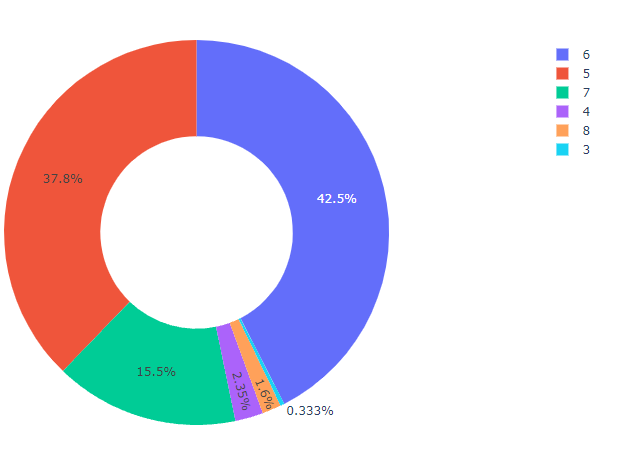
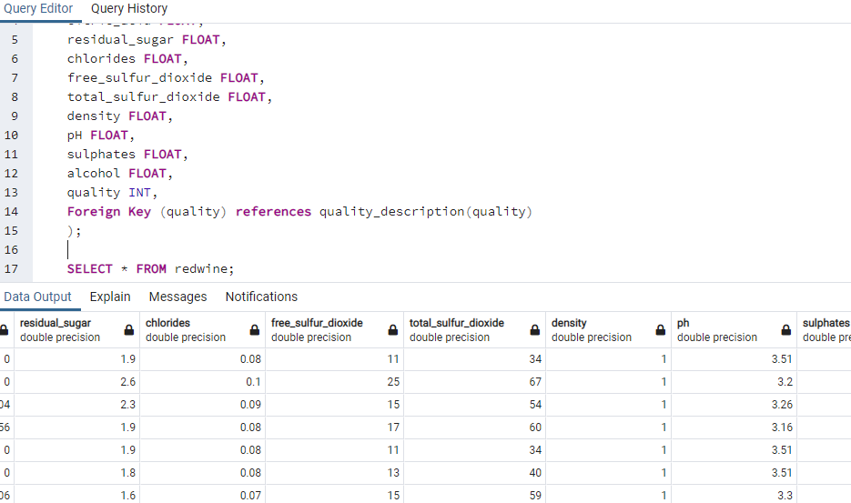
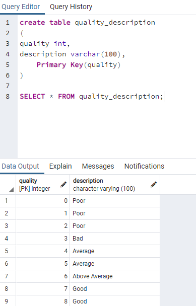
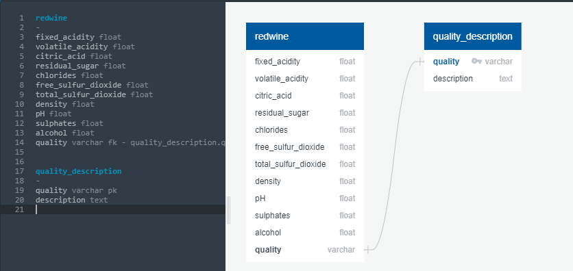
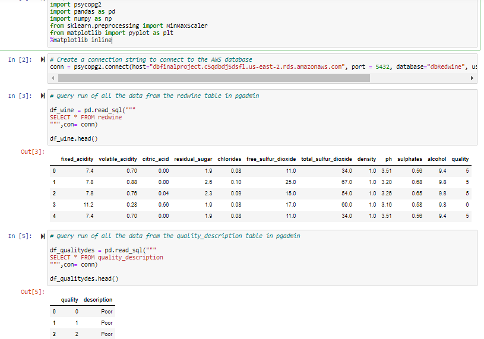

# Presentation Slides

https://docs.google.com/presentation/d/13iBVAwCW7nVu1PN9-PxDMlZ2ScLaE1C7cwxS58eAy3k/edit#slide=id.gf2e70d8c6f_2_98

# Outline of the project

## Overview of the project:

- This project explore th Red Wine Quality Data Set of the Portuguese "Vinho Verde" wine., available on the UCI machine learning repository 
  (https://archive.ics.uci.edu/ml/datasets/wine+quality). For more details, consult: [Web Link] or the reference [Cortez et al., 2009]. Due 
  to privacy and logistic issues, only physicochemical (inputs) and sensory (the output) variables are available (e.g. there is no data about 
  grape types, wine brand,wine selling price, etc.).
- Quality description, i.e. whether the wine is 'Good' or 'Average' is the main focus of this project. We will be carrying out an analysis to
  ascertain which variables can best affect the quality of wine, and what are their optimal quantities.
  
## Database:

- We have created a relational database(RDS) on AWS and the csv file with the dataset is saved in the S3 bucket
- After this, a database is created in pgadmin using the endpoint of the database created above on AWS

## Structure of the dataset:

- This dataset, there are 1.599 wines with 11 chemical properties (fixed acidity, volatile acidity, citric acid, residual sugar, chlorides, 
  free sulphur dioxide, total sulphur dioxide, density, pH, sulphates, alcohol) and quality as variables
- Description column has been added to the dataset that describes the quality as ‘good’ , ‘average’ or ‘not good’ 
- The majority of wines in the dataset are under 5 or 6 quality
   
- Most of the wines have pH between 3.2 and 3.4
- Average sugar amount is 2.54 g/dm^3 with the maximum 15.5
- There’s a wide range of alcohol percentage, from 8% to 14%
- The variables with greater correlation values with quality are alcohol, volatile acidity and sulphates

## ERD

We have added a new column to the dataset, i.e., 'description' from another table.Both of the tables were created in pgadmin.

Table redwine

Table quality_description

The column quality is the primary key in the quality_description table and the foregein key in the quality table. The picture below displays
the relatinship.

## Connection in Jupyter Notebook for the Machine Learning Model

- To connect to the AWS datset, the connection string is created through the databse adapter "psycopg2"
- Two dataframes have been created through running the sql queries

## Data Exploration and Analysis Phase

**Relationships established with the wine quality:**

- Wine quality is correlated with alcohol, volatile acidity, sulphates and citric acid
- None of the variables are strongly correlated
- Fixed acidity, residual sugar, chlorides, free sulfur dioxide, total sulfur dioxide and pH have very poor correlation with wine quality
- Density shows some correlation with wine quality

**Relationship established between other variables:**

- Free sulfur dioxide and total sulfur dioxide are correlated 
- Fixed acidity and citric acid are also correlated
- Density is highly correlated with fixed acidity and negatively correlated with alcohol
- Alcohol is highly correlated with quality and has negative correlation with density

## Dashboard

- We made different data visualization charts using tableau. From kaggle we downloaded the Red Wine Quality Dataset and imported that file into tableau. The charts represented wine, alcohol, sulphate quality, as well as acidity levels of chlorides.

## Wine Quality
 This chart represented the red wine quality. There were bin ranges created on the quality attribute. Most of the wine quality is average level in bin ranges of 4.5. The data was filtered by the descriptions (Average, Good, Not Good) 
 
 

## Sulphate Quality
  This was a bar chart of the sulphates against the quality. The sulphate quality is also average level at most bin quantities. Only some of the sulphates have good quality and very few have not good quality. The data was filtered by descriptions (average, good, and not good)
  
  

  
 ## Alcohol vs Quality
  This was a line chart with alcohol vs quality. The alcohol that was described as good had higher quality level than other types. The alcohol described as not good was a straight line. The alcohol described as average fluctuated up and down from 6 and below. There was no filtered data for this chart.
  
  

  
 ## Acidity
  This was a bar chart of chlorides vs acidity levels. Most of the chlorides are at average level. Some of the chlorides were at good level. Only few of them were at not good level. Those chlorides have higher fixed acidity than volatile acidity. There was no filtered data for this chart. There were different colors used to indicate each type of chloride.  
  
  

# Machine Learning Analysis

## Data Preprocessing

Data precrocessing will be kept to a minimum, because there are no null values, no missing values, and all values are numerical.

- Separating feature data and label data per usual
- Labels will be encoded for binary classifiers "good" and "not good"
- Splitting into training (80%) and testing (20%) data sets
- Creating standard scalars to decrease unecessary effects of features with large values on model

## Train the ML Model with Standard Decision Tree
Feature selection:
- All 11 phsyiochemical features are selected providing the most input data to train the model.
- 1 relative ranking feature, quality, is selected as well
Feature engineering:
- Quality is conditionally converted to a binary classification as either Good or Not Good.
- Wines with a quality score 7 or greater = Good, 6 or lower = Not good
- This engineering was done prior to joining the tables when loading in the data
Criteria for model choice (decision tree):
- Because missing data effects this type of model the least, this allows us to use this type of model in the future if we have less information about a wine.
- Despite the greater computation expense, the dataset being used is reasonably small and manageable w/respect to computation time.

## Decision Tree Model Performance

## Train the ML Model with Random Forest Classifier

Slightly better accuracy, but more importantly, more sensitive model - This is important because we don't want to miss any good bottles of wine!

