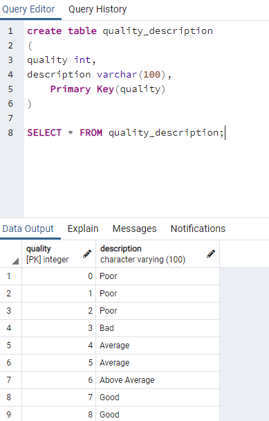
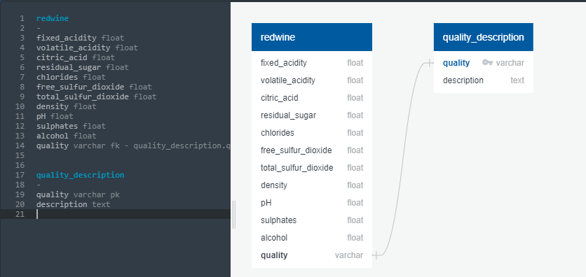
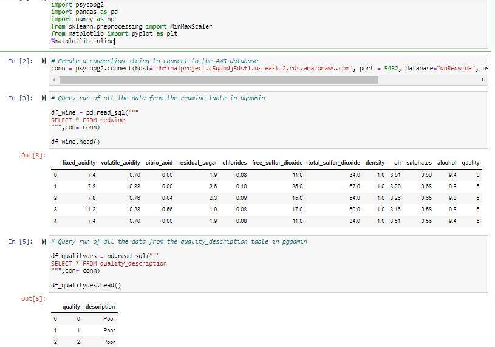

# Dataset

For this project we are using the Red Wine Quality Data Set of the Portuguese "Vinho Verde" wine., available on the UCI machine learning
repository (https://archive.ics.uci.edu/ml/datasets/wine+quality). It's a csv file.

# Database

- We have created a relational database(RDS) on AWS and the csv file with the dataset is saved in the S3 bucket
- After this, a database is created in pgadmin using the endpoint of the database created above on AWS

# ERD

Two tables have been created in the pgadmin and data imported from the S3 bucket. 

Table redwine

Table quality_description

The column quality is the primary key in the quality_description table and the foregein key in the quality table. The picture below displays
the relatinship.

# Connection in Jupyter Notebook for the Machine Learning Model

- To connect to the AWS datset, the connection string is created through the databse adapter "psycopg2"
- Two dataframes have been created through running the sql queries

